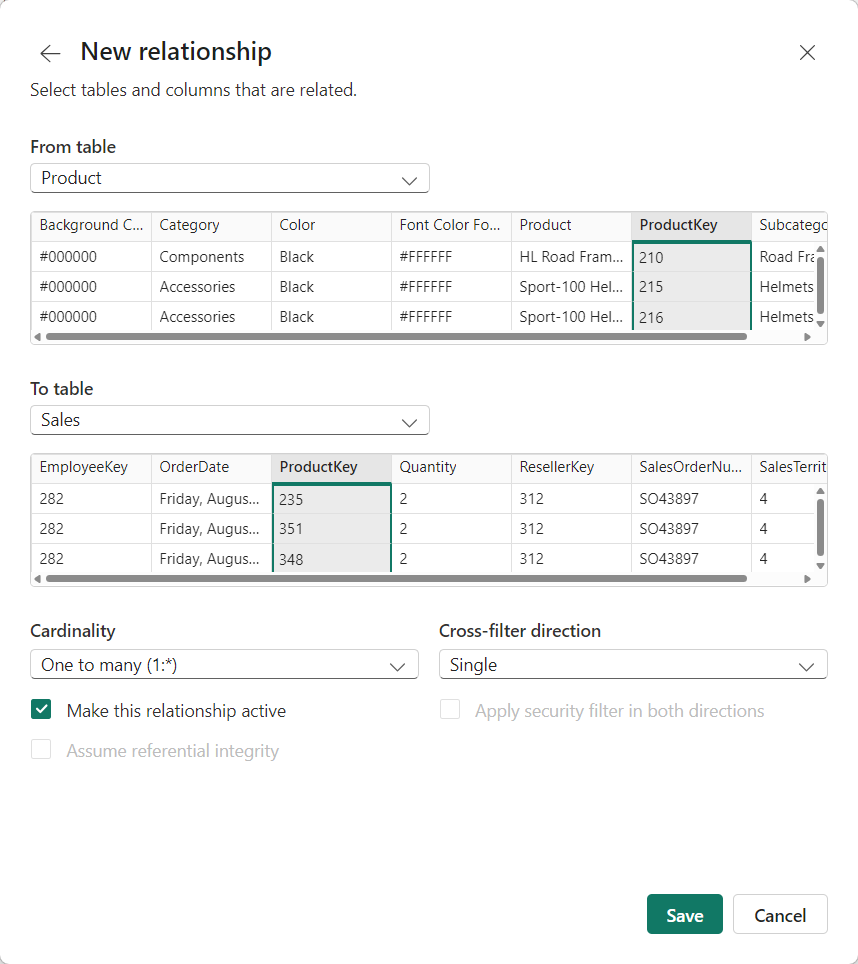
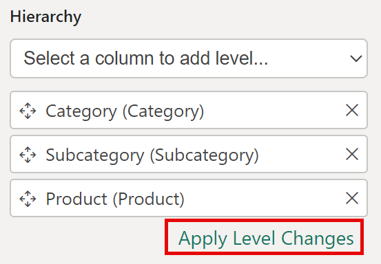
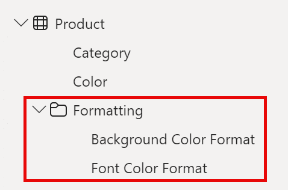
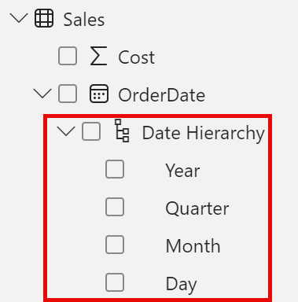
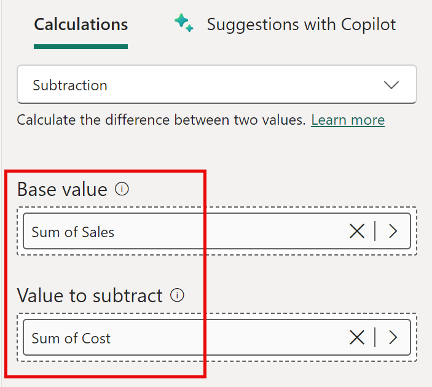

---
lab:
    title: 'Design a Data Model in Power BI'
    module: 'Design a Data Model in Power BI'
---

# Design a Data Model in Power BI

## Lab story

In this lab, you'll commence developing the data model. It will involve creating relationships between tables, and then configuring table and column properties to improve the friendliness and usability of the data model. You'll also create hierarchies and create quick measures.

In this lab you learn how to:

- Create model relationships
- Configure table and column properties
- Create hierarchies

**This lab should take approximately 45 minutes.**

## Get started

To complete this exercise, first open a web browser and enter the following URL to download the zip folder:

`https://github.com/MicrosoftLearning/PL-300-Microsoft-Power-BI-Data-Analyst/raw/Main/Allfiles/Labs/03-configure-data-model-in-power-bi-desktop/03-model-data.zip`

Extract the folder to the **C:\Users\Student\Downloads\03-model-data** folder.

Open the **03-Starter-Sales Analysis.pbix** file.

> ***Note**: You can dismiss the sign-in by selecting **Cancel**. Close any other informational windows. Select **Apply Later**, if prompted to apply changes.*

## Create model relationships

In this task, you'll create model relationships. The file was configured to not identify relationships between tables, which isn't the default setting, but is recommended to prevent extra work creating the correct relationships for your model.

> **Important**: *The labs use a shorthand notation to reference a field. It will look like this: **Product \| Category**. In this example, **Product** is the table name and **Category** is the field name.*

1. In Power BI Desktop, at the left, select the **Report view** icon.

     

1. To view all table fields, in the **Data** pane, right-click an empty area, and then select **Expand All**.

1. To create a table visual, in the **Data** pane, from inside the **Product** table, check the **Category** field.

1. To add another column to the table, in the **Data** pane, check the **Sales \| Sales** field.

1. Notice that the table visual lists four product categories, and that the sales value is the same for each, and the same for the total.

     

     > *The issue is that the table is based on fields from different tables. The expectation is that each product category displays the sales for that category. However, because there isn’t a model relationship between these tables, the **Sales** table isn't filtered. You’ll now add a relationship to propagate filters between the tables.*

1. Select the **Model** view icon from the left navigation pane, and select **Manage Relationships**.

     

1. In the **Manage Relationships** window, notice that no relationships are yet defined. To create a relationship, select **New relationship**.

1. Configure the relationship from **Product** table to **Sales** table. Notice the following elements were automatically configured:

    - **ProductKey columns in each table are selected**. *The columns were selected because they share the same name and data type. You may need to find matching columns with different names in real data.*
    - **Cardinality type is One To Many (1:\*)**. *The cardinality was automatically detected, because Power BI understands that the **ProductKey** column from the **Product** table contains unique values. One-to-many relationships are the most common cardinality, and all relationship you create in this lab will be this type.*
    - **Cross Filter Direction type is Single**. *Single filter direction means that filters propagate from the “one side” to the “many side”. In this case, it means filters applied to the **Product** table will propagate to the **Sales** table, but not in the opposite direction.*
    - **Make This Relationship Active is checked**. *Active relationships propagate filters. It’s possible to mark a relationship as inactive so filters don’t propagate. Inactive relationships can exist when there are multiple relationship paths between tables. In this case, model calculations can use special functions to activate them.*

     

1. Select **OK**, notice in the **Manage Relationships** window that the new relationship is listed, and then select **Close**.

     

Notice there's now a connector between the two tables (*it doesn't matter if the tables are positioned next to each other*).
    - You can interpret the cardinality that is represented by the **1** and **(*)** indicators.
    - Filter direction is represented by the arrow head.
    - A solid line represents an active relationship; a dashed line represents an inactive relationship.
    - Hover the cursor over the relationship to highlight the related columns.

### Create additional relationships

There’s an easier way to create a relationship. In the model diagram, you can drag and drop columns to create a new relationship.

1. To create a new relationship using a different technique, from the **Reseller** table, drag the **ResellerKey** column onto the **ResellerKey** column of the **Sales** table.

    > ***Tip**: Sometime a column doesn’t want to be dragged. If this situation arises, select a different column, and then select the column you intend to drag again, and then try again. Ensure that you see the new relationship added to the diagram.*

     

1. Use the new technique to create the following two model relationships:

     - **Region \| SalesTerritoryKey** to **Sales \| SalesTerritoryKey**
     - **Salesperson \| EmployeeKey** to **Sales \| EmployeeKey**

1. In the diagram, arrange the tables so that the **Sales** table is positioned in the center of the diagram, and the related tables are arranged about it. Position the disconnected tables to the side.

     

1. In the report view, notice that the table visual updated to display different values for each product category.

    > *Filters applied to the **Product** table now propagate to the **Sales** table.*

     

1. **Save** the Power BI Desktop file.

## Configure the Product table

In this task, you'll configure the **Product** table with a hierarchy and display folder.

1. In **Model view > Data pane**, if necessary, expand the **Product** table to reveal all fields.

1. To create a hierarchy, in the Data pane, right-click the **Category** column, and then select **Create Hierarchy**.

1. Update the name to **Products** (right-click or double-click to rename).

1. To add the second level to the hierarchy, in the **Properties** pane, in the **Hierarchy** dropdown list, select **Subcategory** (you might need to scroll down inside the pane).

1. To add the third level to the hierarchy, in the **Hierarchy** dropdown list, select **Product**.

1. To complete the hierarchy design, select **Apply Level Changes**.

     

1. In the **Data** pane, notice the **Products** hierarchy. To reveal the hierarchy levels, expand the **Products** hierarchy.

     

1. To organize columns into a display folder, in the **Data** pane, first select the **Background Color Format** column.

1. While pressing the **Ctrl** key, select the **Font Color Format** column.

1. In the **Properties** pane, in the **Display Folder** box, enter **Formatting**.

     

1. In the **Data** pane, notice that the two columns are now inside a folder.

   > *Display folders are a great way to organize  tables, especially for tables that comprise many fields. They're logical presentation only.*

     

## Configure the Region table

In this task, you'll configure the **Region** table with a hierarchy and updated categories.

1. In the **Region** table, create a hierarchy named **Regions**, with the following three levels:

     - Group
     - Country
     - Region

1. Select the **Country** column (not the **Country** hierarchy level).

1. In the **Properties** pane, expand the **Advanced** section (at the bottom of the pane), and then in the **Data Category** dropdown list, select **Country/Region**.

    

    > *Data categorization can provide hints to the report designer. In this case, categorizing the column as country or region provides more accurate information to Power BI when it renders a map visualization.*

## Configure the Reseller table

In this task, you'll configure the **Reseller** table to add a hierarchy and update data categories.

1. In the **Reseller** table, create a hierarchy named **Resellers**, with the following two levels:

     - Business Type
     - Reseller

1. Create a second hierarchy named **Geography**, with the following four levels:

     - Country-Region
     - State-Province
     - City
     - Reseller

1. Set the **Data Category** for the following columns (not within the hierarchy):

    - Country-Region to **Country/Region**
    - State-Province to **State or Province**
    - City** to **City**

## Configure the Sales table

In this task, you'll configure the **Sales** table with updated descriptions, formatting, and summarization.

1. In the **Sales** table, select the **Cost** column.

1. In the **Properties** pane, in the **Description** box, enter: *Based on standard cost*.

 > *Descriptions can be applied to tables, columns, hierarchies, or measures. In the **Data** pane, description text is revealed in a tooltip when a report author hovers their cursor over the field.*

1. Select the **Quantity** column.

1. In the **Properties** pane, from inside the **Formatting** section, slide the **Thousands Separator** property to **Yes**.

1. Select the **Unit Price** column.

1. In the **Properties** pane, from inside the **Formatting** section, set the **Decimal Places** property to **2**.

1. In the **Advanced** group (you may need to scroll down to locate it), in the **Summarize By** dropdown list, select **Average**.

 > *By default, numeric columns will summarize by summing values together. This default behavior isn't suitable for a column like **Unit Price**, which represents a rate. Setting the default summarization to average will produce a meaningful result.*

## Bulk update properties

In this task, you'll update multiple columns using single bulk updates. You'll use this approach to hide columns, and format column values.

1. From the **Model view** > **Data** pane, select the **Product \| ProductKey** column.

1. While pressing the **Ctrl** key, select the following 13 columns (spanning multiple tables):

     - Region \| SalesTerritoryKey
     - Reseller \| ResellerKey
     - Sales \| EmployeeKey
     - Sales \| ProductKey
     - Sales \| ResellerKey
     - Sales \| SalesOrderNumber
     - Sales \| SalesTerritoryKey
     - Salesperson \| EmployeeID
     - Salesperson \| EmployeeKey
     - Salesperson \| UPN
     - SalespersonRegion \| EmployeeKey
     - SalespersonRegion \| SalesTerritoryKey
     - Targets \| EmployeeID

1. In the **Properties** pane, slide the **Is Hidden** property to **Yes**.

 > *The columns were hidden because they’re either used by relationships or will be used in row-level security configuration or calculation logic.*

  *You’ll use the **SalesOrderNumber** in a calculation in the **Create DAX Calculations in Power BI Desktop** lab.*

1. Multi-select the following three columns:

     - Product \| Standard Cost
     - Sales \| Cost
     - Sales \| Sales

1. In the **Properties** pane, from inside the **Formatting** section, set the **Decimal Places** property to **0** (zero).

## Explore the model interface

In this task you'll switch to Report view, review the data model interface, and configure the auto date/time setting.

1. Switch to **Report** view.

1. In the **Data** pane, notice the following:

     - Columns, hierarchies and their levels are fields, which can be used to configure report visuals
     - Only fields relevant to report authoring are visible
     - The **SalespersonRegion** table isn't visible—because all of its fields are hidden
     - Spatial fields in the **Region** and **Reseller** table are adorned with a spatial icon
     - Fields adorned with the sigma symbol (Ʃ) will summarize, by default
     - A tooltip appears when hovering the cursor over the **Sales \| Cost** field

1. Expand the **Sales \| OrderDate** field, and then notice that it reveals a **Date Hierarchy**. The **Targets \| TargetMonth** field delivers a similar hierarchy.

      

> *Important**: *These hierarchies weren't created by you. They were created automatically as a default setting. There's a problem, however. The Adventure Works financial year commences on July 1 of each year. But, in these automatically created date hierarchies, the date hierarchy year commences on January 1 of each year.*

1. To turn off the **Auto date/time** setting, Navigate to **File > Options and Settings > Options**.

1. Under the **Current File** section, navigate to **Data Load > Time Intelligence**, and uncheck **Auto Date/Time**.

    

1. In the **Data** pane, notice that the date hierarchies are no longer available.

## Create quick measures

In this task, you'll create two quick measures to calculate profit and profit margin. A quick measure creates the calculation formula for you. They’re easy and fast to create for simple and common calculations.

1. In the **Data** pane, right-click the **Sales** table, and then select **New Quick Measure**.

     

1. In the **Quick Measures** window, in the **Calculation** dropdown list, from inside the **Mathematical Operations** group, select **Subtraction**.

     

1. In the **Data** pane of the **Quick Measures** window, expand the **Sales** table.

1. Drag the **Sales** field into the **Base Value** box.

1. Drag the **Cost** field into the **Value to Subtract** box, then select **Add**.  

     

1. In the **Data** pane, inside the **Sales** table, notice that new measure. 
    > *Measures are indicated by the calculator icon.*

     

1. To rename the measure, right-click it, select **Rename**, then rename to **Profit**.

    > *Tip: To rename a field, you can also double-click it, or select it and press **F2**.*

1. In the **Sales** table, add a second quick measure, based on the following requirements:

     - Use the **Division** mathematical operation
     - Set the **Numerator** to the **Sales \| Profit** field
     - Set the **Denominator** to **Sales \| Sales** field
     - Rename the measure as **Profit Margin**

1. Ensure the **Profit Margin** measure is selected, and then on the **Measure Tools** contextual ribbon, set the format to **Percentage**, with two decimal places.

     

1. To test the two measures, first select the **Table** visual.

1. In the **Data** pane, check the two measures.

     

1. Select and drag the right guide to widen the table visual.

     

1. Verify that the measures produce reasonable results that are correctly formatted.

     

## Create a many-to-many relationship

In this task, you'll create a many-to-many relationship between the **Salesperson** table and the **Sales** table.

1. In Power BI Desktop, in Report view, in the **Data** pane, check the follow two fields to create a new **table** visual.

     - Salesperson \| Salesperson
     - Sales \| Sales

     

     > *The table displays sales made by each salesperson. However, there’s another relationship between salespeople and sales. Some salespeople belong to one, two, or possibly more sales regions. In addition, sales regions can have multiple salespeople assigned to them.*
     >
     > *From a performance management perspective, a salesperson’s sales (based on their assigned territories) need to be analyzed and compared with sales targets. You’ll create relationships to support this analysis in the next exercise.*

1. Notice that **Michael Blythe** has sold almost $9 million.

1. Switch to Model view, then drag the **SalespersonRegion** table to position it between the **Region** and **Salesperson** tables.

1. Use the drag-and-drop technique to create the following two model relationships:

     - **Salesperson \| EmployeeKey** to **SalespersonRegion \| EmployeeKey**
     - **Region \| SalesTerritoryKey** to **SalespersonRegion \| SalesTerritoryKey**

    > *The **SalespersonRegion** table can be considered to be a bridging table.*

1. Switch to Report view, and then notice that the visual hasn't updated—the sales result for Michael Blythe hasn't changed.

1. Switch back to Model view, and then follow the relationship filter directions (arrowhead) from the **Salesperson** table.

     > *Consider that the **Salesperson** table filters the **Sales** table. It also filters the **SalespersonRegion** table, but it doesn't continue by propagating filters to the **Region** table (the arrowhead is pointing the wrong direction).*

     

1. To edit the relationship between the **Region** and **SalespersonRegion** tables, double-click the relationship.

1. In the **Edit Relationship** window, in the **Cross Filter Direction** dropdown list, select **Both**.

1. Check the **Apply Security Filter in Both Directions** checkbox, then select OK.

     

1. Notice that the relationship has a double arrowhead now.

     

1. Switch to Report view, and then notice that the sales values have still not changed.

    > *The issue now relates to the fact that there are two possible filter propagation paths between the **Salesperson** and **Sales** tables. This ambiguity is internally resolved, based on a “least number of tables” assessment. To be clear, you shouldn’t design models with this type of ambiguity—the issue will be addressed in part later in this lab, and by the completion of the **Create DAX Calculations in Power BI Desktop** lab.*

1. Switch to Model view to force filter propagation via the bridging table. Edit (double-click) the relationship between the **Salesperson** and **Sales** tables.

1. In the **Edit Relationship** window, uncheck the **Make This Relationship Active** checkbox, and select **OK**.

    > *The filter propagation will now follow the only active path.*

1. In the diagram, notice that the inactive relationship is represented by a dashed line.

     

1. Switch to Report view, and then notice that the sales for Michael Blythe are now nearly $22 million.

     

1. Notice also, that the sales for each salesperson—if added—would exceed the table total.

     > *It’s a common observation of a many-to-many relationship due to the double, triple, etc. counting of regional sales results. Consider Brian Welcker, the second salesperson listed. His sales amount equals the total sales amount. It’s the correct result due to the fact the he’s the Director of Sales; his sales are measured by the sales of all regions.*
     >
     > *While the many-to-many relationship is now working, it’s now not possible to analyze sales made by a salesperson (because the relationship is inactive). You’ll be able to reactivate the relationship when you introduce a calculated table that will allow analyzing sales made in the sales region(s) assigned to the salesperson (for performance analysis) in the **Create DAX Calculations in Power BI Desktop** lab.*

1. Switch to Model view, and then in the diagram, select the **Salesperson** table.

1. In the **Properties** pane, in the **Name** box, replace the text with **Salesperson (Performance)**.

    > *The renamed table now reflects its purpose: it’s used to report and analyze the performance of salespeople based on the sales of their assigned sales regions.*

## Relate the Targets table

In this task, you'll create a relationship to the **Targets** table.

1. Create a relationship from the **Salesperson (Performance) \| EmployeeID** column and the **Targets \| EmployeeID** column.

1. In Report view, add the **Targets \| Target** field to the table visual.

1. Resize the table visual so all columns are visible.

     

 > *It’s now possible to visualize sales and targets—but take care for two reasons. First, there’s no filter on a time period, and so targets also include future target amounts. Second, targets aren't additive, and so the total shouldn't be displayed. They can either be disabled by formatting the visual or removed by using calculation logic.*

## Lab complete
